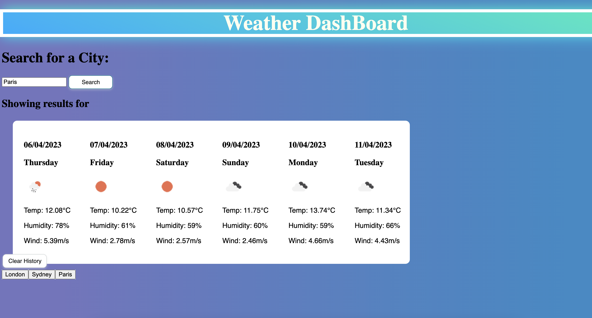
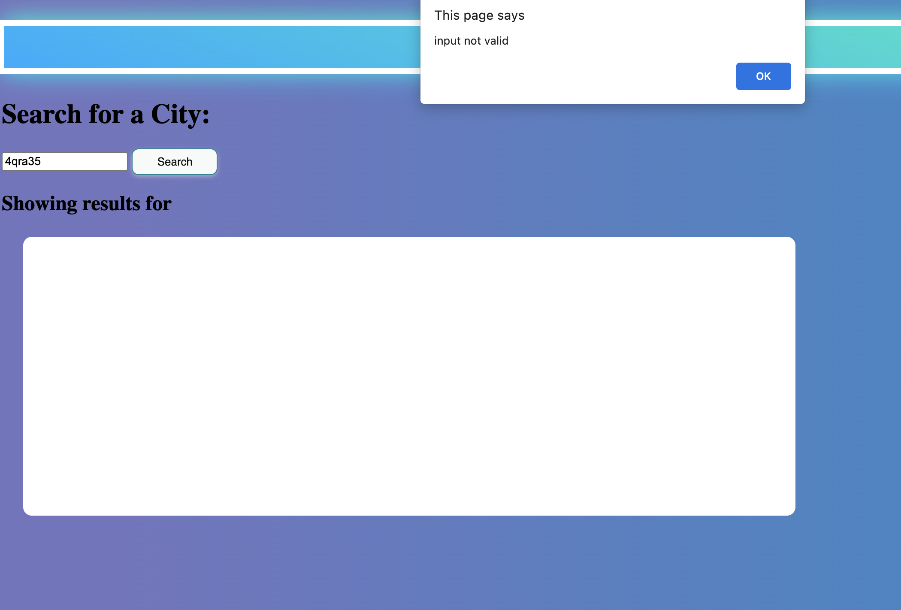
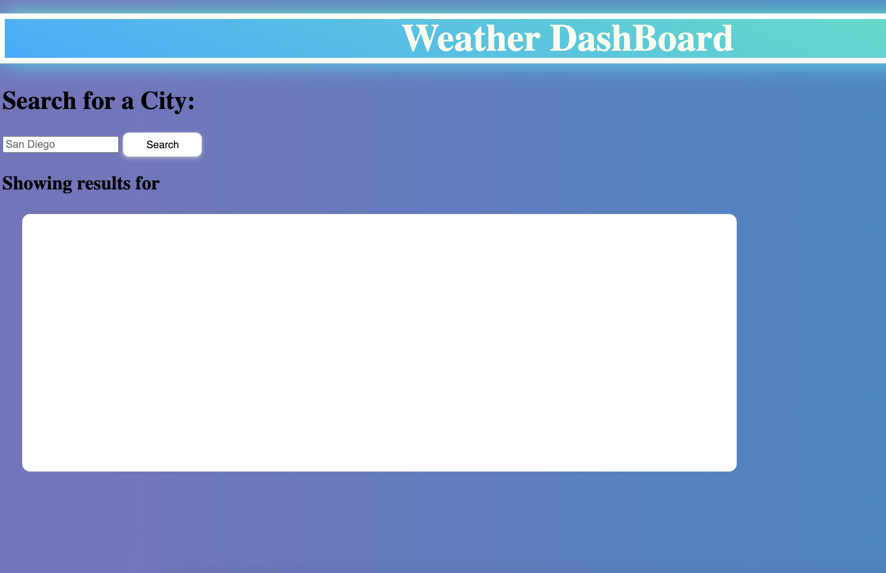

# 06-Server-Side-APIs-Weather-Dashboard

Weather dashboard that features **todays weather** followed by a **five day forecast**

  
 
# Website Features
This website features
 * An input box where the user can enter a city name  
 * A search button: If an invalid city is entered the user will recieve an alert  
 * Previous searches are stored in a city button which the user can click on to see that citys weather again (instead of having to search the same city in the search input) 
 * A 'clear history' button allows the user to clear all their previous searches from the page  
 * If there are stored cities in local storage these will appear in the broswer even when the user refreshes the page  
 * When the user types in a city, a new city button is created only if that city isn't already stored (this prevents two buttons for the same city being created) 

# Website Link

 Link to the deployed site:
 [Weather Dashboard](https://jvn101.github.io/06-Server-Side-APIs-Weather-Dashboard/)
 
# Invalid Inputs:
A user alert appears when an incorrect city is entered
   

# Clear History Button:
All the saved cities are deleted when the clear history button is entered
   
  
 

***
### Contact us
Contact our developer for any questions  
<JVN101@software.com>
